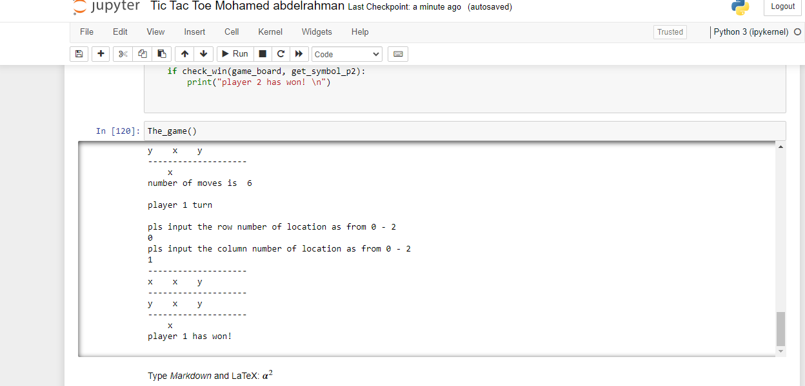

# Tic Tac Toe Game
- This project is a submission for electropi.ai online academy.
This project implements a command-line version of the classic Tic Tac Toe game in Python.

## How to Play

1. Clone or download the repository.
2. Run the `Tic Tac Toe Mohamed abdelrahman.ipynb` file using Python 3.
3. Follow the on-screen instructions to play the game.
4. Input your moves as prompted.

## Screenshots

## Requirements

- Python 3.x

## Contributing

Contributions are welcome! If you find any issues or have suggestions for improvement.
## License

This project is licensed under the MIT License. See the [LICENSE](LICENSE) file for details.
